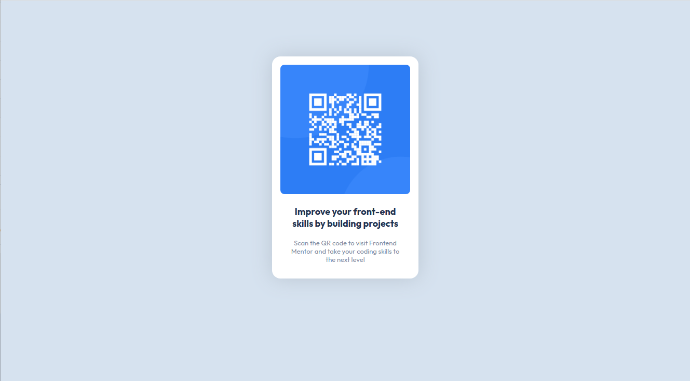

# Frontend Mentor - QR code component solution

This is a solution to the [QR code component challenge on Frontend Mentor](https://www.frontendmentor.io/challenges/qr-code-component-iux_sIO_H). Frontend Mentor challenges help you improve your coding skills by building realistic projects. 

## Table of contents

- [Overview](#overview)
  - [Screenshot](#screenshot)
  - [Links](#links)
- [My process](#my-process)
  - [Built with](#built-with)
  - [What I learned](#what-i-learned)
  - [Continued development](#continued-development)
  - [Useful resources](#useful-resources)
- [Author](#author)
- [Acknowledgments](#acknowledgments)

**Note: Delete this note and update the table of contents based on what sections you keep.**

## Overview

### Screenshot



## My process

Just build it

### Built with

- HTML and CSS

### What I learned

How to do box shadows

```css
.shadowed {
  box-shadow: 0 0 40px hsl(212, 21%, 78%);

}
```

### Useful resources

- [MDN](https://developer.mozilla.org/en-US/docs/Web/CSS/box-shadow)

